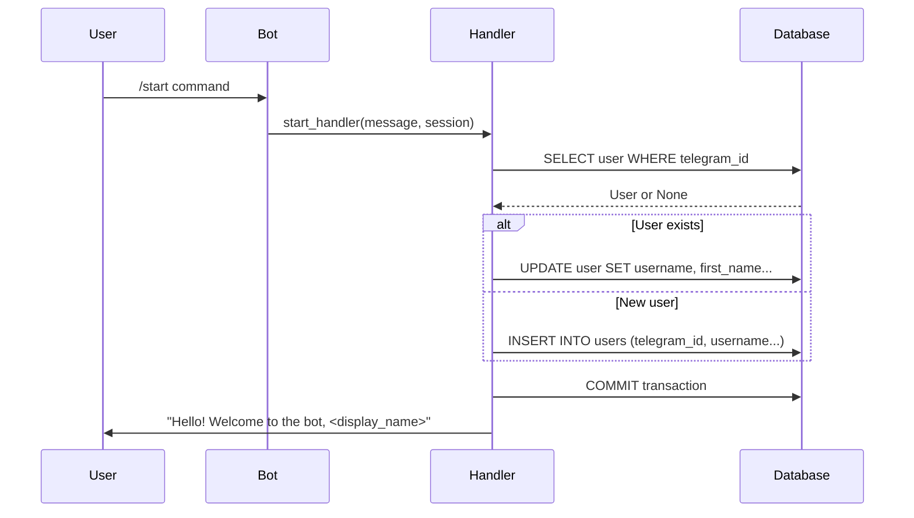

# Bot API Documentation

Commands, handlers, and API interactions for Hello AI Bot with OpenAI integration.

## Bot Commands

| Command  | Description               | Response                         | Database Action             |
| -------- | ------------------------- | -------------------------------- | --------------------------- |
| `/start` | Get personalized greeting | Enhanced greeting with bot info and commands | Creates/updates user record |
| `/do <message>` | Direct AI interaction | AI-generated response based on user role | Saves conversation history |
| _any text_ | AI conversation         | Intelligent AI response with context | Saves conversation to database |
| _predefined queries_ | Creator/repository info | Pre-defined responses for common questions | None |

## Enhanced Architecture

All handlers with AI integration located in a single file: `app/handlers.py`

### Handler Structure

```python
from aiogram import F, Router, types
from aiogram.filters import Command
from sqlalchemy import select
from sqlalchemy.ext.asyncio import AsyncSession
from app.services.openai_service import OpenAIService

router = Router()

@router.message(Command("start"))
async def start_handler(message: types.Message, session: AsyncSession) -> None:
    # Enhanced greeting with bot capabilities
    pass

@router.message(Command("do"))
async def do_ai_handler(message: types.Message, session: AsyncSession) -> None:
    # Direct AI interaction via command
    pass

@router.message(F.text)
async def default_handler(message: types.Message, session: AsyncSession) -> None:
    # AI-powered response to any text message
    pass
```

## Command Details

### `/start` Command

**Handler**: `app/handlers.py:start_handler()`

**Purpose**:
- Welcome new users with comprehensive bot information
- Create or update user record in database using direct SQLAlchemy operations
- Provide enhanced greeting with AI capabilities and available commands
- Show bot features and usage instructions

**Flow**:



**Code Implementation**:

```python
@router.message(Command("start"))
async def start_handler(message: types.Message, session: AsyncSession) -> None:
    """Handle /start command."""
    if not message.from_user:
        await message.answer("Hello! Welcome to the bot, <b>Unknown</b>", parse_mode=ParseMode.HTML)
        return

    telegram_user = message.from_user

    # Direct database query - no service layer
    stmt = select(User).where(User.telegram_id == telegram_user.id)
    result = await session.execute(stmt)
    user = result.scalar_one_or_none()

    if user:
        # Update existing user
        user.username = telegram_user.username
        user.first_name = telegram_user.first_name
        user.last_name = telegram_user.last_name
        user.language_code = telegram_user.language_code
        logger.info(f"Updated user: {user.display_name}")
    else:
        # Create new user
        user = User(
            telegram_id=telegram_user.id,
            username=telegram_user.username,
            first_name=telegram_user.first_name,
            last_name=telegram_user.last_name,
            language_code=telegram_user.language_code,
        )
        session.add(user)
        logger.info(f"Created new user: {user.display_name}")

    # Commit changes
    await session.commit()

    # Send greeting
    greeting = f"Hello! Welcome to the bot, <b>{user.display_name}</b>"
    await message.answer(greeting, parse_mode=ParseMode.HTML)
```

**Key Features**:
- ✅ Direct SQLAlchemy operations
- ✅ Simple error handling with middleware
- ✅ Standard Python logging
- ✅ Automatic session management

**Response Format**:

```html
Enhanced HTML greeting with bot information:
"Hello! Welcome to Hello AI Bot, 😎 <b>username</b>

🤖 What I can do:
• Answer questions and have conversations
• Help with various tasks using AI
• Process any text message you send

📋 Commands:
• /start - Show this welcome message
• /do <message> - Chat with AI (optional)
• Just type any message - I'll respond with AI

🔗 Source code: https://github.com/ivan-hilckov/hello-ai-bot
💡 Built with aiogram 3.0 + OpenAI API"

Where display_name follows same priority:
1. username (if available)
2. first_name + last_name (if username not available)
3. "User{telegram_id}" (fallback)
```

**Database Operations**:

```sql
-- Check if user exists
SELECT * FROM users WHERE telegram_id = $1;

-- Update existing user
UPDATE users
SET username = $1, first_name = $2, last_name = $3, language_code = $4, updated_at = NOW()
WHERE telegram_id = $5;

-- Create new user
INSERT INTO users (telegram_id, username, first_name, last_name, language_code, is_active, created_at, updated_at)
VALUES ($1, $2, $3, $4, $5, true, NOW(), NOW());
```

### AI Text Handler (Default)

**Handler**: `app/handlers.py:default_handler()`

**Purpose**:
- Process any text message through OpenAI API
- Provide intelligent AI responses using user's role prompt
- Save conversation history to database
- Handle predefined responses for specific queries

**Code Implementation**:

```python
@router.message(F.text)
async def default_handler(message: types.Message, session: AsyncSession) -> None:
    """Handle all text messages through AI service."""
    if not message.text:
        return

    # Process any text message through AI
    await process_ai_message(message, session, message.text)
```

**Response Processing**:
1. **Check predefined responses** (creator info, repository info)
2. **Initialize OpenAI service** if no predefined match
3. **Get user role** and conversation context
4. **Generate AI response** with token management
5. **Save conversation** to database
6. **Return intelligent response** to user

### `/do` Command Handler

**Handler**: `app/handlers.py:do_ai_handler()`

**Purpose**:
- Explicit AI interaction command
- Same functionality as default handler but with command syntax
- Useful for users who prefer explicit commands

**Usage**: `/do <your message>`

**Example**: `/do Explain quantum physics`

### Predefined Responses

**System includes predefined responses for**:
- Creator information (triggered by: создатель, creator, автор, author, разработчик, developer)
- Repository information (triggered by: репозиторий, repository, github, код, source code)

## Middleware Integration

### Database Middleware

**File**: `app/middleware.py`

**Purpose**: Inject database session into all handlers

```python
class DatabaseMiddleware(BaseMiddleware):
    """Middleware to inject database session into handlers."""

    async def __call__(self, handler, event, data):
        """Inject database session into handler data."""
        async with AsyncSessionLocal() as session:
            try:
                data["session"] = session
                result = await handler(event, data)
                await session.commit()
                return result
            except Exception:
                await session.rollback()
                raise
```

**Session Management**:
- ✅ One session per request
- ✅ Automatic commit on success
- ✅ Automatic rollback on error
- ✅ Clean resource cleanup

## Error Handling

### Simple Error Handling

No complex error handling - relies on middleware for session management:

```python
# Session errors handled by middleware
async def start_handler(message: types.Message, session: AsyncSession) -> None:
    # If any exception occurs:
    # 1. Middleware catches it
    # 2. Session is rolled back
    # 3. Exception is re-raised
    # 4. Bot continues functioning
```

### User Error Scenarios

| Scenario | Handler Response | Database Action |
|----------|------------------|-----------------|
| Missing user info | `"Hello! Welcome to the bot, Unknown"` | None |
| Database error | Standard aiogram error handling | Rollback via middleware |
| Invalid message | Default handler response | None |

## API Performance

### Response Times

| Operation | Target Time | Database Queries |
|-----------|-------------|------------------|
| `/start` command (new user) | <300ms | 1 SELECT + 1 INSERT |
| `/start` command (existing user) | <200ms | 1 SELECT + 1 UPDATE |
| Default handler | <100ms | 0 queries |

### Database Query Patterns

```python
# Most efficient patterns for simple architecture

# Single user lookup (primary pattern)
stmt = select(User).where(User.telegram_id == telegram_id)
user = (await session.execute(stmt)).scalar_one_or_none()

# User creation (atomic operation)
user = User(telegram_id=telegram_id, username=username)
session.add(user)
await session.commit()

# User update (minimal fields)
user.username = new_username
await session.commit()
```

## Testing API

### Handler Testing

```python
@pytest.mark.asyncio
async def test_start_handler_new_user(test_session):
    """Test /start command creates new user."""
    # Create mock message
    message = create_mock_message("/start", user_id=123456789)

    # Call handler
    await start_handler(message, test_session)

    # Verify user created
    stmt = select(User).where(User.telegram_id == 123456789)
    user = (await test_session.execute(stmt)).scalar_one_or_none()

    assert user is not None
    assert user.telegram_id == 123456789

@pytest.mark.asyncio
async def test_start_handler_existing_user(test_session):
    """Test /start command updates existing user."""
    # Create existing user
    user = User(telegram_id=123456789, username="oldname")
    test_session.add(user)
    await test_session.commit()

    # Mock message with updated info
    message = create_mock_message("/start", user_id=123456789, username="newname")

    # Call handler
    await start_handler(message, test_session)

    # Verify user updated
    await test_session.refresh(user)
    assert user.username == "newname"

@pytest.mark.asyncio
async def test_default_handler():
    """Test default handler response."""
    message = create_mock_message("Hello")

    # Call handler (no session needed)
    await default_handler(message)

    # Verify response sent
    assert message.answer.called
    assert "Send /start" in message.answer.call_args[0][0]
```

### Mock Objects

```python
def create_mock_message(text: str, user_id: int = 123456789, username: str = "testuser"):
    """Create mock Telegram message for testing."""
    message = Mock()
    message.text = text
    message.from_user = Mock()
    message.from_user.id = user_id
    message.from_user.username = username
    message.from_user.first_name = "Test"
    message.from_user.last_name = "User"
    message.answer = AsyncMock()
    return message
```

## Webhook API (Production)

### Simple Webhook Endpoint

**File**: `app/main.py`

For production deployment with webhook mode:

```python
if settings.webhook_url:
    # Simple FastAPI app
    app = FastAPI()

    @app.post("/webhook")
    async def webhook(update: dict[str, Any]):
        """Simple webhook endpoint."""
        telegram_update = Update(**update)
        await dp.feed_update(bot, telegram_update)
        return {"ok": True}

    # Set webhook
    await bot.set_webhook(url=settings.webhook_url)
```

**Endpoint Details**:
- **URL**: `POST /webhook`
- **Input**: Telegram Update JSON
- **Output**: `{"ok": True}`
- **Processing**: Direct to aiogram dispatcher

## Simplified vs Enterprise

### What Was Removed

| Enterprise Feature | Purpose | Why Removed |
|-------------------|---------|-------------|
| Service Layer abstraction | Business logic separation | Direct operations simpler |
| Dependency injection | Complex object management | Direct instantiation fine |
| Caching layer | Performance optimization | Database fast enough |
| Metrics collection | Performance monitoring | Overkill for simple bot |
| Complex error handling | Enterprise-grade reliability | Basic handling sufficient |

### Current Approach Benefits

- ✅ **Simplicity**: All logic in handlers
- ✅ **Performance**: Direct database operations
- ✅ **Maintainability**: Single file structure
- ✅ **Testing**: Straightforward unit tests
- ✅ **Learning**: Clear code flow

This simplified API design is perfect for:
- Learning Telegram bot development
- Prototyping new features
- Small to medium bots
- Resource-constrained environments

The architecture can be scaled up when needed by adding service layers, caching, and enterprise patterns.
